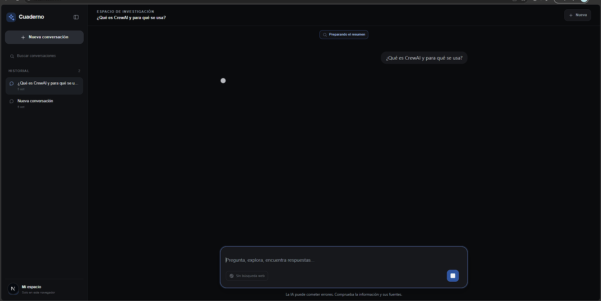
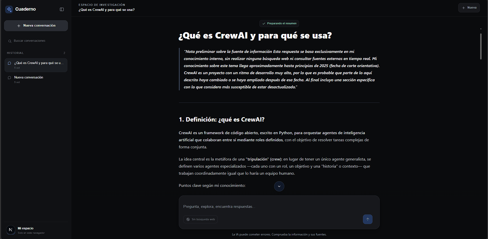
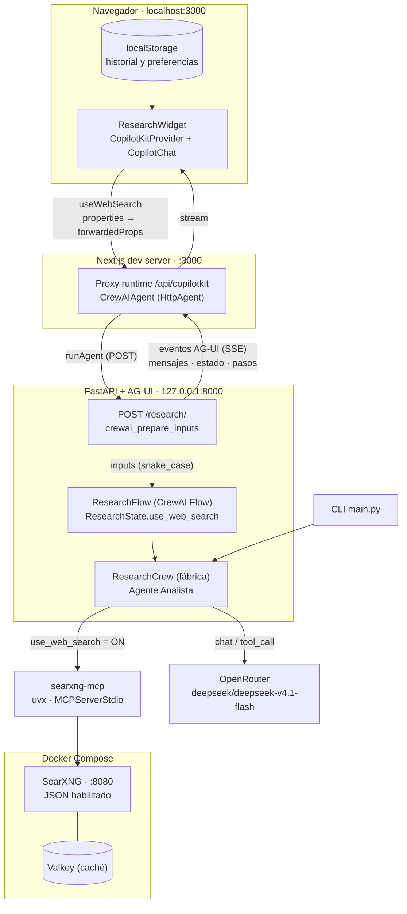

# CrewAI Research: CopilotKit, AG-UI y SearXNG

Demo local con un agente de investigación CrewAI, búsqueda web en SearXNG por MCP y chat React transmitido mediante AG-UI/CopilotKit. La fábrica de `ResearchCrew` se comparte entre el CLI y el servicio web.






## Arquitectura



Flujo: el toggle de búsqueda web viaja como `properties` del provider, se fusiona en `forwardedProps` de cada `runAgent`, y `crewai_prepare_inputs` lo normaliza a snake_case dentro de `ResearchState` (declarado `exclude=True` para que el eco de estado del cliente no lo pise). Con búsqueda activada el crew consulta SearXNG vía MCP; desactivada, el agente responde solo con el LLM. Los informes y preferencias se persisten en `localStorage`.

## Requisitos

- Python 3.10–3.13 y [uv](https://docs.astral.sh/uv/).
- Node.js 20 o superior y npm.
- Docker Desktop con Docker Compose.
- Una clave válida de OpenRouter.

## Configuración

En PowerShell, configura `OPENROUTER_API_KEY` en `.env` en la raíz o en `backend/.env`. Esa clave solo se lee en Python; no uses variables `NEXT_PUBLIC_*` para secretos. `AGENT_URL` es una URL interna no secreta del servicio AG-UI, se configura en `frontend/.env.local` desde `frontend/.env.example` si hace falta cambiarla y por defecto es `http://127.0.0.1:8000/research/`.

Instala las dependencias Python desde la raíz:

```powershell
uv sync
```

Instala las dependencias web:

```powershell
cd frontend
npm ci
cd ..
```

## Ejecutar la aplicación

Abre tres terminales en la raíz del proyecto:

1. SearXNG y Valkey:

   ```powershell
   docker compose up -d
   ```

2. API Python con AG-UI:

   ```powershell
   uv run uvicorn backend.api.server:app --host 127.0.0.1 --port 8000 --reload
   ```

3. UI Next.js:

   ```powershell
   cd frontend
   npm run dev
   ```

Abre [http://localhost:3000](http://localhost:3000). El endpoint de diagnóstico del backend está en [http://127.0.0.1:8000/health](http://127.0.0.1:8000/health). El endpoint de streaming AG-UI es `POST /research/`.

## CLI

El mismo crew sigue disponible desde la raíz:

```powershell
uv run python main.py "novedades recientes en inteligencia artificial generativa"
```

## Verificación

Pruebas Python:

```powershell
uv run pytest
```

Pruebas de componentes/frontend:

```powershell
cd frontend
npm test
npm run build
```

Prueba Playwright (requiere que API, SearXNG y OpenRouter estén configurados para verificar una respuesta real):

```powershell
npm run test:e2e
```

La configuración local de SearXNG habilita JSON en `searxng/settings.yml`; comprueba una consulta con:

```powershell
Invoke-RestMethod "http://localhost:8080/search?q=crewai&format=json"
```

Para detener SearXNG y Valkey:

```powershell
docker compose down
```

## Si `uv sync` muestra `RECORD file is invalid`

En PowerShell, cierra el entorno activo y reconstruye el entorno y la caché de `uv`:

```powershell
deactivate
Remove-Item -Recurse -Force .venv -ErrorAction SilentlyContinue
uv cache clean
uv sync
```

La primera búsqueda puede tardar más porque `uvx` descarga `searxng-mcp[mcp]` al iniciar el servidor MCP. La búsqueda SearXNG es autoalojada, pero las respuestas se procesan mediante OpenRouter y pueden tener costo según tu cuenta y modelo.
